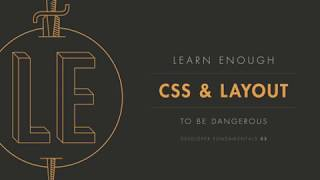
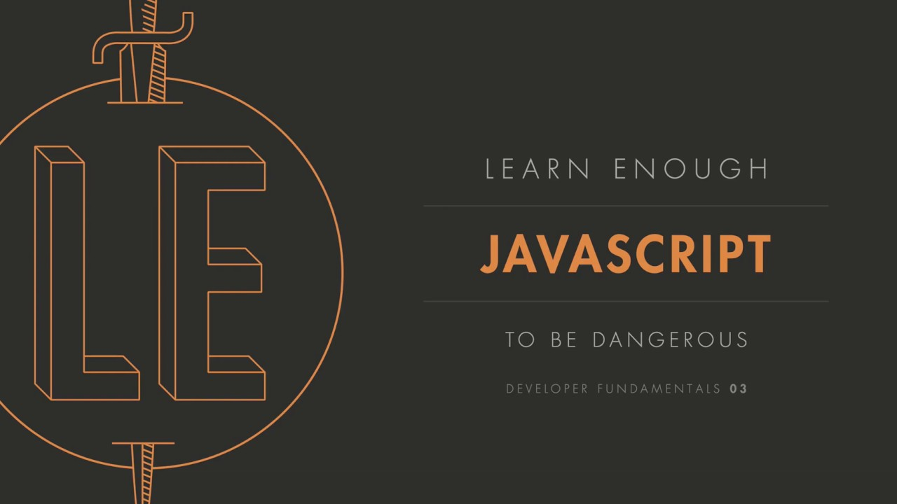
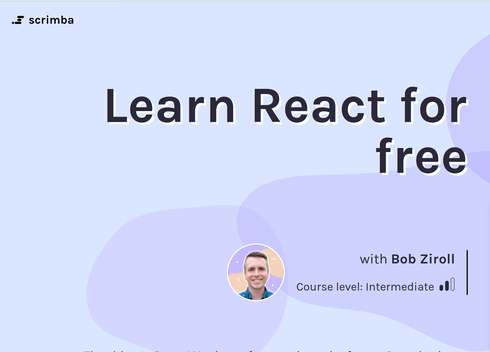

# Web Development Resources

## Prerequsites

|                Description                 |                                                                                               Preview                                                                                               |                    Link to get started with it                     |
| :----------------------------------------: | :-------------------------------------------------------------------------------------------------------------------------------------------------------------------------------------------------: | :----------------------------------------------------------------: |
|    1. Learn enough HTML to be dangerous    | 
  
 |      [Here you go](https://www.learnenough.com/html-tutorial)      |
|    2. Learn enough CSS to be dangerous     |               
  
               | [Here you go](https://www.learnenough.com/css-and-layout-tutorial) |
| 3. Learn enough JavaScript to be dangerous |                          
  
                           |       [Here you go](https://www.learnenough.com/javascript)        |
|            4. Learn enough Git             |         
 [")](https://www.atlassian.com/git "Git complete intro (atlassian)") 
          |            [Here you go](https://www.atlassian.com/git)            |

## Intermediate

|            Description             |                                                                            Preview                                                                             |             Link to get started with it             |
| :--------------------------------: | :------------------------------------------------------------------------------------------------------------------------------------------------------------: | :-------------------------------------------------: |
| 1. Learn React for free on Scrimba | 
  
 | [Here you go](https://scrimba.com/learn/learnreact) |
